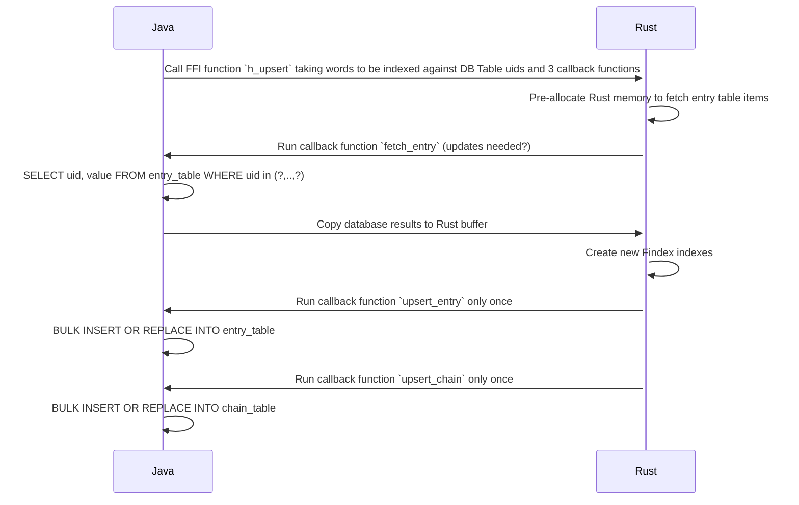
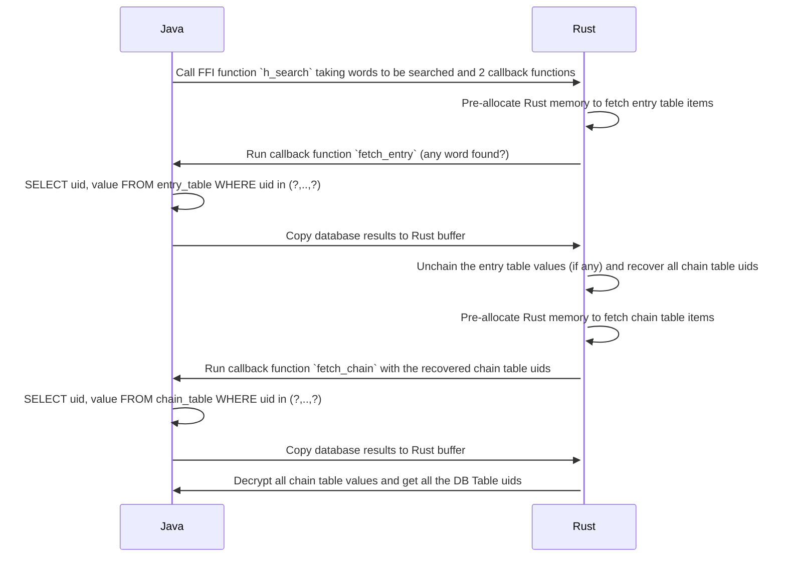
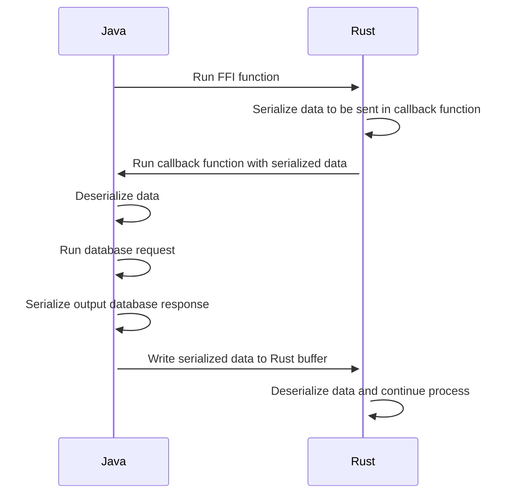

Findex helps to securely make search queries on outsourced encrypted data and can be used combined with Cloudproof Encryption.

This document explains how to use Findex implementation.

<!-- toc -->

- [I) Theory](#i-theory)
- [II) Description of the Findex Tables](#ii-description-of-the-findex-tables)
- [III) Using callbacks](#iii-using-callbacks)
- [IV) Upsert function](#iv-upsert-function)
  - [Implementation details](#implementation-details)
- [V) Search function](#v-search-function)
  - [Implementation details](#implementation-details-1)
- [VI) Launch project](#vi-launch-project)
  - [Build Rust](#build-rust)
    - [Build and tests for Pyo3](#build-and-tests-for-pyo3)
- [VI) Technical elements of code implementation](#vi-technical-elements-of-code-implementation)
  - [Buffer serialization](#buffer-serialization)
    - [Vectors of vectors serialization](#vectors-of-vectors-serialization)
    - [Hashmap of vectors serialization](#hashmap-of-vectors-serialization)
    - [Zoom on callback serialization](#zoom-on-callback-serialization)
  - [Benchmarks](#benchmarks)
    - [Two indexing strategies](#two-indexing-strategies)
      - [Graphs vs Naive](#graphs-vs-naive)

<!-- tocstop -->

# I) Theory

Findex technical documentation can be found here: _[Findex](http://gitlab.cosmian.com/other/cryptography/-/tree/main/crypto_clients/CA-TS/docs)_

# II) Description of the Findex Tables

Findex relies on two server-side tables, Index Entry Table and Index Chain Table, to solve the following search problem:

    How to securely recover the UIDs of DB Table to obtain the matching lines from a given keyword?

This solution is on top of an encrypted database, called DB Table for consistency, that actually stores the content to be requested.

- Index Entry Table: provides the mandatory values to access the Index Chain Table.
- Index Chain Table: securely stores all the lists of uids from DB Table for the indexed keywords.

Each index table contains two columns: the `uid` and `value` columns where `value` is an encrypted value.

|              | uid | encrypted value |
|--------------|-----|-----------------|
| Size (bytes) | 32  | see below       |

    the encrypted value for the Index Chain Table:

|              | AES-GCM encrypted data | MAC | Nonce |
|--------------|------------------------|-----|-------|
| Size (bytes) | 32                     | 16  | 12    |

    the encrypted value for the Index Entry Table:

|              | AES-GCM encrypted data | MAC | Nonce |
|--------------|------------------------|-----|-------|
| Size (bytes) | Size_UID + Size_Key    | 16  | 12    |

    where Size_UID = 32 bytes, and Size_Key = 32 bytes.

# III) Using callbacks

Findex implementation uses callback functions in order to keep all the Findex algorithm in the same place. Those callbacks are then responsible of database queries and insertions.

Findex algorithm is implemented in Rust, and two functions are exposed:

- Upsert: index keywords from DB Table
- Search: perform query over the encrypted elements and return uids from DB Table

Those Rust functions can be used directly in Rust, and are also exposed as FFI, working with Python and Java wrappers.

# IV) Upsert function

Upsert function aims to index data from DB Table.
Takes as arguments:

- K: key of 32 bytes - known by authorized users and Directory Authority
- Data to index (DB Table uids and associated keywords)
- 3 callbacks to query on server-side tables:
  - fetch (uid, value) from Index Entry Table for specific uids (function `fetch_entry`)
  - upsert (uid, value) elements on Index Entry Table (function `upsert_entry`)
  - upsert (uid, value) elements on Index Chain Table (function `upsert_chain`)

## Implementation details

This diagram illustrates the `Upsert` function when Java client call Findex through FFI function.



# V) Search function

Search function uses the indexed elements to retrieve uids from DB Table containing the requested keywords. In another words, search function recovers all DB Table uids of the researched words.

Takes as arguments:

- K: key of 32 bytes - known by authorized users and Directory Authority
- Words: words to search
- 2 callbacks:
  - fetch (uid, value) from Index Entry Table for specific uids
  - fetch (uid, value) from Index Chain Table for specific uids

## Implementation details

This diagram illustrates the `Search` function when Java client call Findex through FFI function.



# VI) Launch project

## Build Rust

The crate is 2 main modules:

- `core`: contains the **Findex** algorithm with the 2 traits `Upsert` and `Search` to be implemented in external interfaces
- `interfaces`: contains interfaces such as FFI interface or WebAssembly interface (that implements the 2 **Findex** _core traits_)

To build the core only, run:

```bash
cargo build --release
```

To build the FFI Cosmian interfaces:

```bash
cargo build --release --features ffi
```

To build the WebAssembly interface:

```bash
cargo build --release --features wasm_bindgen
```

And finally, to build everything and test it, run:

```bash
cargo build --release --all-features
cargo test --release --all-features
```

### Build and tests for Pyo3

> When a new function/class is added to the PyO3 interface, write its signature in `python/cosmian_findex/__init__.pyi`.

- Local build (see `gitlab-ci` for release build)

```bash
python/scripts/test.sh
```

See a full example in the CloudProof Python repo.

# VI) Technical elements of code implementation

## Buffer serialization

Data passed between Rust code and external callbacks is serialized using LEB128 algorithm.

LEB128 or **Little Endian Base 128** is a variable-length code compression used to store arbitrarily large integers in a small number of bytes. Here LEB128 is used to encode **byte array length**.

In Findex, 2 data structures are serialized/deserialized:

- `Vec<Vec<u8>>` (corresponding to a list of UIDs for example)
- `HashMap<Vec<u8>,Vec<u8>>` (corresponding to an list of **Entry Table** items or a list of **Chain Table** items)

### Vectors of vectors serialization

Each element of the array is an byte array. Each byte array is serialized separately and written contiguously at the end of the final output byte array. Serialization has the following structure:

|              | LEB128 first byte array length | byte array | ... | LEB128 last byte array length | byte array |
|--------------|--------------------------------|------------|-----|-------------------------------|------------|
| Size (bytes) | from 1 to 8                    | n          | ... | from 1 to 8                   | n          |

Example with a vector of 100 uids of 32 bytes:

|              | LEB128 uid_1 length | uid_1 | ... | LEB128 uid_100 length | uid_100 |
|--------------|---------------------|-------|-----|-----------------------|---------|
| Size (bytes) | 1                   | 32    | ... | 1                     | 32      |

### Hashmap of vectors serialization

Each element of the map is a **Key/Value** of byte arrays. First the **Key** byte array is serialized then the **Value** byte array and both are written contiguously at the end of the final output byte array. Serialization has the following structure:

|              | LEB128 first Key length | Key | LEB128 first Value length | Value | ... | LEB128 last Key length | Key | LEB128 last value length | Value |
|--------------|-------------------------|-----|---------------------------|-------|-----|------------------------|-----|--------------------------|-------|
| Size (bytes) | from 1 to 8             | n   | from 1 to 8               | n     | ... | from 1 to 8            | n   | from 1 to 8              | n     |

Example of a hashmap of 100 uids and values of Entry Table:

|              | LEB128 uid_1 length | uid_1 | LEB128 value_1 length | value_1 | ... | LEB128 uid_100 length | uid_100 | LEB128 value_100 length | value_100 |
|--------------|---------------------|-------|-----------------------|---------|-----|-----------------------|---------|-------------------------|-----------|
| Size (bytes) | 1                   | 32    | 1                     | 92      | ... | 1                     | 32      | 1                       | 92        |

### Zoom on callback serialization

When Java client (for example) runs Findex using shared native libraries (build from Rust), here is an illustration on how data is sent:



## Benchmarks

Indexing of 19948 first names in the [first_names.txt](datasets/first_names.txt) file in an in-memory database.
The first names have an average size of 6 characters.

First names are indexed from size 3 to full value e.g. `Martine: mar, mart, marti, martin, martine` (first names smaller than 3 are indexed as such e.g. `Al`)

The resulting entry table size has 44488 records occupying a total size of 5387 kbytes (124 bytes per word).

Searches: as an average, the search of a word (part or full) will return a number of results equal to 6 x the average number of locations per word. A location may be a database UID, a file name etc... where the word is present.

### Two indexing strategies

_Naive_: locations are indexed for all possible slices

- `mar` -> {locations}
- `mart` -> {locations}
- `marti` -> {locations}
- `martin` -> {locations}
- `martine` -> {locations}

_Graphs_:

- `mar` -> `mart`
- `mart` -> `marti`
- `marti` -> `martin`
- `martin` -> `martine`
- `martine` -> {locations}

#### Graphs vs Naive

Disadvantage of graphs: more interactions between client and server: 4 average compared to 1 for the naive solution

Advantage of graphs: optimal storage of the locations info: they are not repeated in the chain table:

| Avg locations | #records graphs | #records naive | ratio | size (kb) graphs | size (kb) naive | ratio |
|---------------|-----------------|----------------|-------|------------------|-----------------|-------|
| 1             | 86018           | 86018          | 1.00  | 5605             | 5704            | 1.01  |
| 2             | 105966          | 172036         | 1.62  | 6994             | 11745           | 1.68  |
| 3             | 125914          | 258054         | 2.04  | 8344             | 17618           | 2.11  |
| 4             | 145862          | 244072         | 2.35  | 9694             | 23491           | 2.42  |
| 5             | 165810          | 430090         | 2.59  | 11044            | 29364           | 2.65  |
